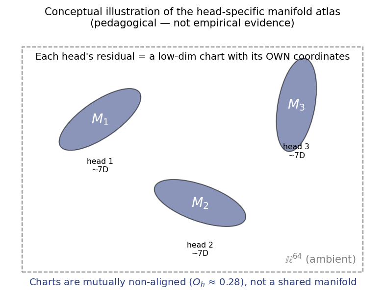
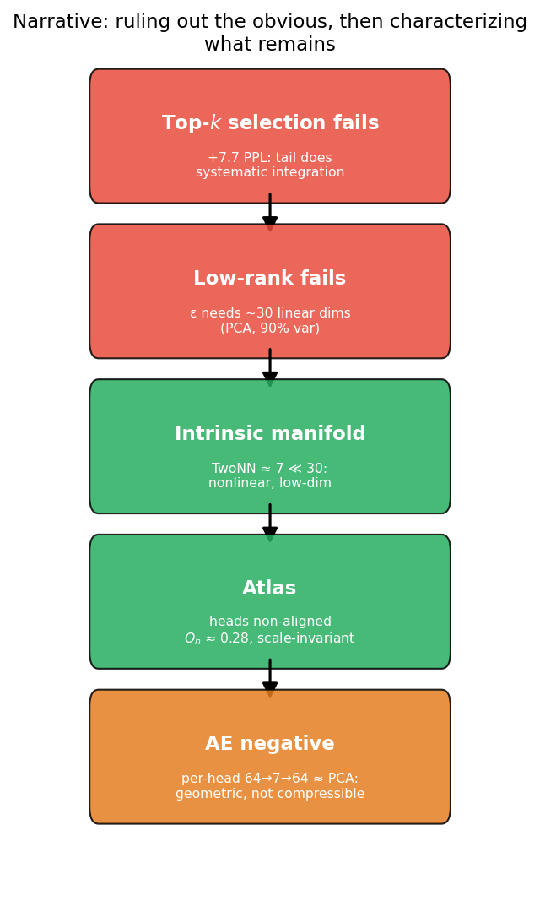
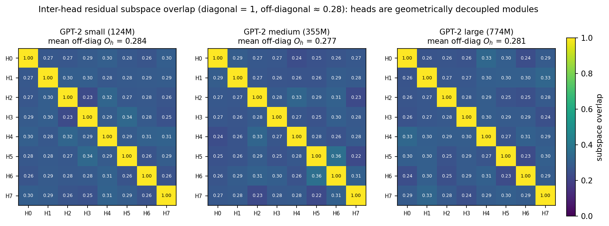
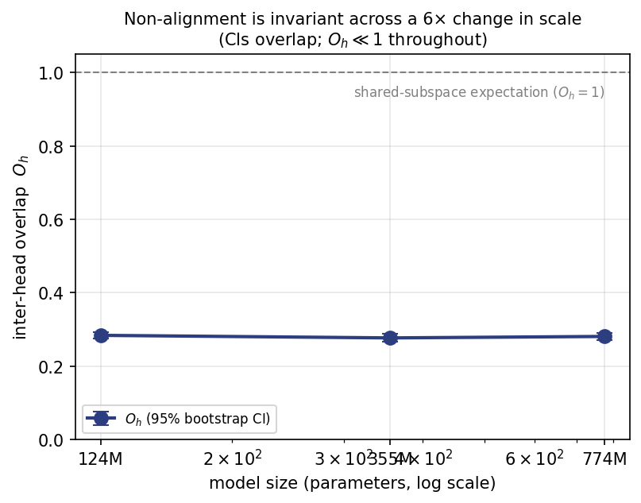
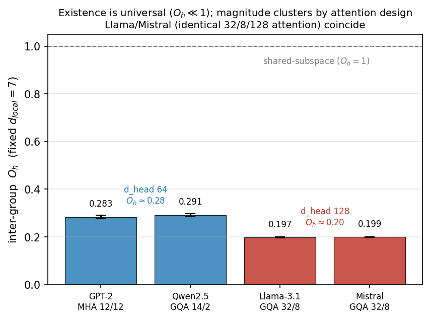
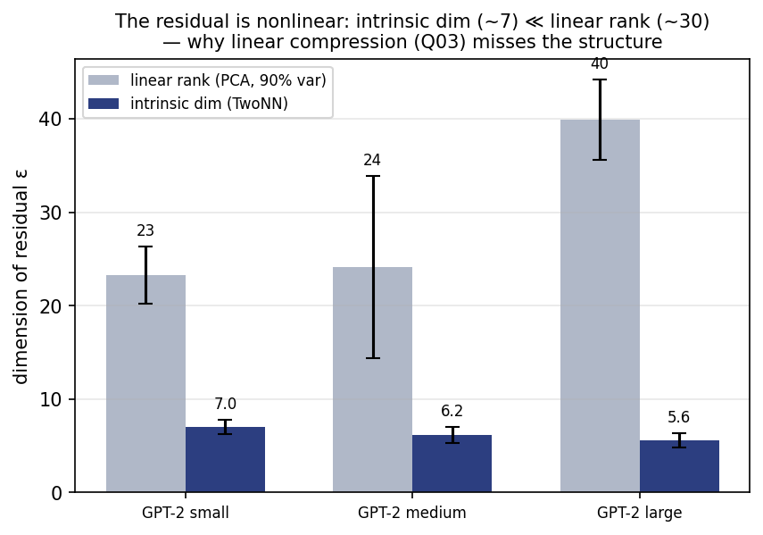
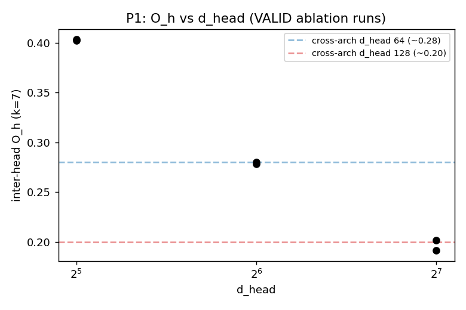
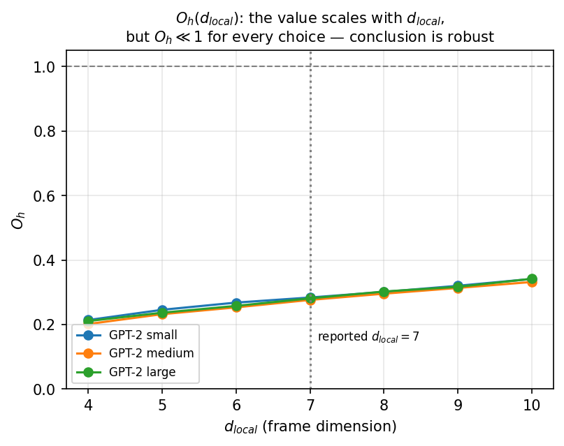
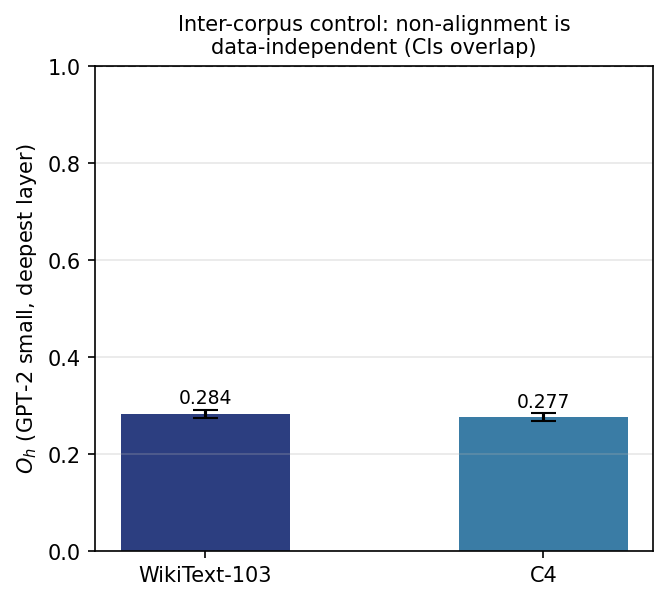
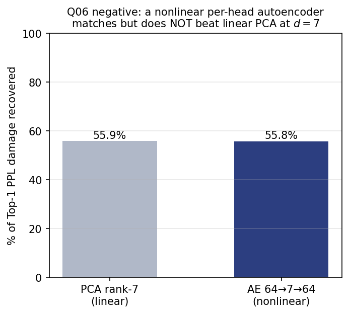

# An Atlas of Head-Specific Residual Manifolds Across Autoregressive Transformer Architectures

<!-- Prior title (GPT-2-only result): "A Scale-Invariant Atlas of Head-Specific Manifolds in Transformer Residual Attention" -->
<!-- Conservative-title alternative: "Head-Specific Nonlinear Manifolds in Transformer Residual Attention" -->
<!-- Earlier working title: "Non-Aligned Manifold Atlas in Transformer Residual Attention" -->

**Juan Pablo Chancay**¹, **Claude (Opus 4.8 / Sonnet 4.6)**²

¹ Independent Researcher · jpcpol@gmail.com
² Anthropic (research assistance)

**Draft — 2026-06-25 · Target venue: NeurIPS / ICLR workshop**

---

## Abstract

We study the geometry of the *residual* of attention — what remains of a head's output after
subtracting its single most-attended value vector. Across **four autoregressive transformer
families — GPT-2, Qwen2.5, Llama-3.1, and Mistral** — this residual is organized as an **atlas of
head-specific nonlinear manifolds**, and the heads occupy **mutually non-aligned subspaces** (mean
pairwise overlap O_h ≪ 1 in every model). The existence of this head-wise organization is robust
across every architecture we test — MHA *and* grouped-query attention (GQA), LayerNorm *and*
RMSNorm, learned positions *and* RoPE — while the *magnitude* of the overlap is architecture-specific
and clusters by attention design: GPT-2/Qwen sit near O_h ≈ 0.28 and Llama/Mistral (identical 32-head
/ 8-KV / d_head-128 attention) near O_h ≈ 0.20, with non-overlapping bootstrap intervals that widen
under a fixed-dimensionality control. Within the GPT-2 family the overlap is additionally
scale-invariant (statistically indistinguishable across a 6× change in model size) and
corpus-invariant. Moving from correlation to intervention, we **train models from scratch** varying
only the head partition: the clusters reproduce (d_head 64 → 0.28, 128 → 0.20), O_h is invariant to
scale at fixed d_head (*fixed-point-like*), and ≥ 4 heads are required for the régime to form —
establishing the head partition's *causal* effect on the overlap (while leaving O_h → model quality
untested). Within this structure, each head's residual is a low-dimensional nonlinear manifold
— intrinsic dimension (TwoNN ≈ 7–11) far below its linear rank (PCA ≈ 30) — and head-centering does
not collapse the union, so the heads are not one shared manifold seen through different offsets. We
rule out the two obvious linear stories (sparse selection and global low-rank compression)
explicitly. Finally, this geometric micro-structure coexists with macroscopic thermodynamic
observables that are *not* scale-invariant (a crystallization depth L_c, derived from
softmax-as-Boltzmann), separating an invariant geometric core from capacity-dependent dynamics. We
use "atlas" descriptively — a collection of local charts — not as a claim of a formal fiber bundle.

---

## 0. From Quantization to Geometry: what these results mean for the project's original objective

This work did not begin as a study of attention geometry. The project (NQP — *Natural Quantization
via State Preparation*) began with a single applied hypothesis: that one could quantize an LLM with
less error by first rotating each layer's weights into the eigenbasis of the model's Fisher
information matrix — a "preparation operator" P̂ — by analogy with measuring a quantum system in the
eigenbasis of its Hamiltonian, where discreteness emerges from the system's own geometry rather than
being imposed externally. The target was a *deployment* method: better post-training quantization.

**That hypothesis was refuted.** Empirically, the Fisher eigenbasis of activations is approximately
rank-2 and does not beat the standard quantization stack (GPTQ + AWQ + QuIP); the
"measure-in-the-Hamiltonian-basis" analogy turned out to be metaphorical, not operational. A
follow-up reformulation as a weight/activation *uncertainty principle* was only partially supported:
the two preparation bases genuinely fail to commute (principal angle ≈ 49°), but that
non-commutativity carries no operational consequence for quantization error. The original applied
goal — a better quantizer — did not survive contact with the data.

**What survived is a different and, we argue, more durable result.** The discipline of trying to
refute the quantization idea forced us to look directly at where information actually lives inside
attention — the residual ε of each head after its dominant value vector is removed. That is where
the structure reported in this paper emerged: a **scale-invariant, inter-corpus-stable atlas of
head-specific, mutually non-aligned manifolds** (O_h ≈ 0.28). Crucially, this is a *representation-
level* object, not a deployment trick. We even tested whether it can be turned back into the
originally-sought compression method — a per-head nonlinear autoencoder at the manifold's intrinsic
dimension (§3.7) — and found a clean negative: it matches but does not beat linear PCA. The geometry
is real but, by this route, not functionally exploitable. We report that honestly rather than
re-promising the application the project started with.

In other words, the project's arc is: *the original idea (quantization via a natural basis) did not
work, but the process of refuting it revealed a new, reproducible geometric structure in transformer
attention.* The quantum analogy that motivated NQP can now be sorted cleanly into three tiers —
decorative (Fisher-basis quantization, refuted), real-but-inert (the non-commuting weight/activation
bases), and literally exact (softmax = Boltzmann, which we use as a measurement device in §3.6). The
contribution of this paper belongs to none of the original applied promises and to the third,
exact tier of the analogy plus a geometric finding that stands on its own evidence.

**Relation to the long-term program.** We do *not* claim the atlas is yet useful. Whether this
geometry is *causal* (atlas → better model) or merely *descriptive* (training → atlas as a
byproduct) is open and, in our view, the central question for this line. The honest current
statement is: the head-wise atlas appears to be an emergent geometric constraint of transformers;
although no direct functional advantage has yet been demonstrated, the structure opens concrete
future directions (geometric routing of heads, diagnostic metrics for head collapse/redundancy,
fine-tuning stability of the atlas) — pursued only with the explicit caution learned from NQP itself:
**the existence of a geometric structure does not imply it is exploitable.**

---

## 1. Introduction

A self-attention head produces an output that is a convex combination of value vectors,
Attn(x) = Σ_i a_i V_i, with weights a = softmax(QKᵀ/√d). A natural decomposition isolates the
single most-attended token i\* and treats everything else as a residual. Writing the identity
explicitly,

> Attn = a_{i\*} V_{i\*} + (1 − a_{i\*}) ε,  where  ε = (1 − a_{i\*})⁻¹ Σ_{i ≠ i\*} a_i V_i.

Here ε is the normalized "tail" of the attention output — the convex combination of the
non-dominant values — and (1 − a_{i\*}) is the total mass on that tail. We study the geometry of ε.

In deep layers the attention distribution becomes highly concentrated (one token dominates),
which invites the hypothesis that the residual ε is negligible, sparse, or low-rank — i.e. that
deep attention has effectively "crystallized" into a selection operation and the tail can be
discarded or cheaply compressed. We test this hypothesis and find it **false**, but the *way* it
fails reveals structure: the residual is neither sparse-replaceable nor linearly low-rank, yet it
is **nonlinearly low-dimensional and head-specific**.

Our central finding is geometric and concerns the relationship *between heads*. Each head's
residual occupies its own low-dimensional nonlinear manifold, and these manifolds are embedded in
**mutually non-aligned subspaces** — they are not coordinatizable by a single shared linear system.
We call this organization an *atlas* (a collection of head-specific charts; see Figure 5 for a
schematic). The strongest, cleanest result is not the dimensionality of the charts but their
**non-alignment**: the inter-head subspace overlap is ≈ 0.28 and is invariant to a 6× change in
model scale.

**Figure 5.** Conceptual illustration of the head-specific manifold atlas: each head's residual is a
low-dimensional chart (~7D) with its own coordinate frame, and the frames are mutually non-aligned
(O_h ≈ 0.28). *Pedagogical illustration; not empirical evidence.*

**Contributions.**
1. A decomposition and measurement protocol for the attention residual ε, with synthetic
   validation of every estimator used (intrinsic dimension, subspace overlap).
2. The central empirical result: residual attention is a **non-aligned, scale-invariant atlas of
   head-specific manifolds** (inter-head overlap O_h ≈ 0.28, 95% CI [0.27, 0.29], statistically
   indistinguishable across GPT-2 small/medium/large and across corpora).
3. Explicit refutation of the obvious compression stories — sparse selection, global low-rank, and
   (a clean negative we contribute) a *per-head nonlinear autoencoder*, which matches but does not
   beat linear PCA at the intrinsic dimension. The residual is geometrically low-dimensional but not
   functionally compressible by these means.
4. A two-layer account separating a **scale-invariant geometric micro-structure** from
   **capacity-dependent macroscopic thermodynamics** (softmax-as-Boltzmann phase structure;
   crystallization depth L_c, which is *not* scale-invariant). As a byproduct, von Neumann entropy
   of the per-head density matrix is a cheap, calibrated proxy for predictive uncertainty.

**Why this matters.** A stable geometric atlas constrains the effective degrees of freedom
available to attention and provides a new representation-level object for studying scaling and
head specialization — independently of whether it yields a compression mechanism (§3.7).

**Scope and anti-overclaim.** All scale-invariance claims are established *within the GPT-2 family
and a fixed training distribution*, not across architectures. "Atlas" is descriptive; we do not
claim a formal fiber bundle.

---

## 2. Setup and Methods

### 2.1 The residual decomposition

For a head h at layer ℓ and query position t, let a^{(t)} = softmax(q_t Kᵀ/√d) be the attention
weights over keys, i\* = argmax_i a_i^{(t)} the dominant key, and

> ε_t = Σ_{i ≠ i\*} a_i^{(t)} V_i / (1 − a_{i\*}^{(t)}).

We collect {ε_t} over many positions and contexts (WikiText-103 validation) per (ℓ, h) and study
the resulting point cloud in ℝ^{d_head} (d_head = 64 for GPT-2). Unless stated otherwise we use the
**deepest layers** (where concentration is highest and the "discard the tail" hypothesis is most
plausible).

### 2.2 Intrinsic dimension (TwoNN)

We estimate intrinsic dimension with the TwoNN estimator (Facco et al. [1]): for each point,
μ = r₂/r₁ (ratio of distances to its two nearest neighbors), and d = (N−1)/Σ_i log μ_i. TwoNN
recovers nonlinear dimension where PCA cannot. **Validation:** on a 2D swiss-roll embedded in ℝ³,
TwoNN returns ≈ 2.7 while PCA reports 3 — it sees the manifold, not the ambient rank.

### 2.3 Inter-head subspace overlap (the atlas test)

For each head we extract a local linear frame B_h ∈ ℝ^{d_head × d_local} via SVD of the
mean-centered residual cloud (the top d_local right-singular vectors, so B_hᵀ B_h = I). For a pair
of heads (h_i, h_j) we take the singular values σ_k of B_iᵀ B_j — the cosines of the principal
angles between the two subspaces, clamped to [0, 1] — and define the **pairwise overlap as their
mean**:

> O(h_i, h_j) = (1 / d_local) Σ_{k=1}^{d_local} σ_k(B_iᵀ B_j),

and O_h is the average of O(h_i, h_j) over all unordered head pairs. We use the mean of the
principal cosines (a normalized Frobenius-style alignment) rather than the maximum (which reports
only the best-aligned direction) or the nuclear norm (unnormalized): the mean answers "on average,
how aligned are the two d_local-dimensional frames?", with O_h = 1 iff the subspaces coincide and
O_h = 0 iff they are orthogonal. **Calibration:** on synthetic data O_h = 1.0 when heads share a
basis and O_h ≈ 0.0 when their bases are orthogonal. We also compute a **head-centered pooled
dimension**: if the heads were one manifold seen through per-head offsets, removing each head's mean
would collapse the pooled intrinsic dimension toward the per-head value (~7); if they are genuinely
non-aligned, it does not.

**Choice of d_local.** We set d_local = 7 because the per-head intrinsic dimension (§2.2, §3.2) is
≈ 6–7; the frame should span the manifold without padding it with noise directions. Because this is
a hyperparameter of the *measurement*, we report a sensitivity analysis over d_local ∈ {4, …, 10}
in §3.1. The *reported value* O_h ≈ 0.283 is specific to d_local = 7; as expected, O_h rises
monotonically with d_local (adding lower-variance directions raises the mean cosine). What is
invariant to the choice is the *conclusion*: O_h stays far below 1 for every k ∈ [4, 10]
(≈ 0.21 → 0.34), so the heads are non-aligned regardless of how the frame is sized. We therefore
fix d_local = 7 (matching intrinsic dimension) for the headline number and treat its absolute value,
not just its sign, as conditional on that choice.

### 2.4 Linear baselines (refuting the obvious)

- **Sparse selection (Top-k):** replace the full attention distribution with its top-k weights
  (renormalized) in chosen layers and measure ΔPPL. This tests whether the tail is functionally
  discardable.
- **Global low-rank:** PCA on ε; report dimensions for 90% variance and the loss recovered by a
  rank-32 projection. This tests linear compressibility.

### 2.5 Thermodynamic observables (softmax = Boltzmann)

softmax(QKᵀ/√d) is literally a Boltzmann distribution with energies E_i = −(q·k_i)/√d and β = 1.
From the same partition function Z the head already computes we read off the Helmholtz free energy
F = −β⁻¹ log Z, mean energy ⟨E⟩, heat capacity C = β²(⟨E²⟩ − ⟨E⟩²), an effective temperature T_eff,
and the von Neumann entropy S_vn(ρ) of the density matrix ρ = Σ_i a_i |v̂_i⟩⟨v̂_i|. Masked keys
(−∞ logits) are handled by zeroing their finite-energy contribution to avoid 0·∞ = NaN. We define
the **crystallization depth** L_c as the layer at which heads transition from a high-T "liquid"
regime to a low-T "crystallized" regime (T_eff → 1, purity → 1).

### 2.6 Models and controls

We use the GPT-2 family [14]: gpt2 (124M, 12 layers), gpt2-medium (355M, 24 layers), and gpt2-large
(774M, 36 layers). Residuals are collected on WikiText-103 [15], with C4 [16] used for the
inter-corpus control. **Critical control:** for any cross-scale comparison of intrinsic dimension or
overlap we fix the number of sampled points N, the number of heads, and the relative layer depth
across models — an early uncontrolled run gave a spuriously identical dimension and taught us to
control N/heads/layers before comparing intrinsic geometry across scales.

---

## 3. Results

We present results in **decreasing order of empirical strength**, which is *not* the order in which
the experiments were run. The strongest result is the inter-head non-alignment and its
scale-invariance; the dimensionality is supportive; the decreasing-dimension trend is exploratory.
Figure 4 summarizes the narrative: we rule out the obvious linear stories, then characterize the
nonlinear structure that remains.

**Figure 4.** Narrative pipeline. Red = refuted hypotheses (Top-k selection, low-rank); green =
positive findings (intrinsic manifold, atlas); orange = the honest functional negative (per-head AE).

### 3.1 (Very strong) Heads are non-aligned, and the non-alignment is scale-invariant

Within a deep layer, the per-head residual subspaces are far from aligned: at d_local = 7 the mean
inter-head overlap is O_h ≈ 0.28 (a value of 1 would mean identical subspaces, 0 orthogonal).
Repeating the measurement across the GPT-2 family under the controlled protocol (same N = 1200, same
8 heads, deepest layer), with a percentile bootstrap over the head pairs:

| model  | params | layers | O_h (d_local=7) | 95% bootstrap CI | head-centered pooled dim |
|--------|--------|--------|-----------------|------------------|--------------------------|
| small  | 124M   | 12     | 0.284           | [0.276, 0.292]   | 7.1                      |
| medium | 355M   | 24     | 0.277           | [0.267, 0.288]   | 6.7                      |
| large  | 774M   | 36     | 0.281           | [0.272, 0.290]   | 5.7                      |

> **O_h ≈ 0.28 across a 6× change in parameters; the three 95% CIs overlap, so the cross-scale
> variation (≈ 0.007) is within sampling error.**

**Figure 1.** Inter-head residual subspace overlap (H×H, d_local = 7) for the deepest layer of each
model. The diagonal is 1 by construction; every off-diagonal entry is ≈ 0.28. The pattern is
visually identical across a 6× change in scale: heads are geometrically decoupled modules, not
rotations of a shared manifold. *This is the paper's central figure.*

**Figure 2.** O_h versus model size with 95% bootstrap confidence intervals. The intervals overlap
and sit far below the shared-subspace expectation (O_h = 1): non-alignment is compatible with
scale-invariance within the GPT-2 family.

This is the rigid result. Two null hypotheses are decisively rejected: heads are **not** a single
shared manifold (which would give O_h ≈ 1), and the structure is **not** explained by per-head
offsets alone (head-centering does not collapse the pooled dimension to the per-head ~7). The heads
are geometrically *decoupled modules*, each with its own coordinate system, and this decoupling is
a stable structural property of the family rather than a small-model artifact.

We therefore state the claim at the level of the geometric property, not the exact number:

> *Across the GPT-2 family, attention heads occupy substantially non-aligned residual subspaces.
> While the absolute value of the overlap metric depends on the choice of local-dimensionality
> parameter d_local, the qualitative result is robust: inter-head overlap remains far below the
> shared-subspace expectation (O_h ≪ 1) across all tested settings, with stable values across model
> scale, dataset size, and relative depth.*

**Robustness (Appendix B).** The value is stable to the measurement choices, with one honest
caveat. Across sample size N ∈ {300, 600, 1200} it moves by ≤ 0.005; across each of the three
deepest layers it moves by ≤ 0.004 (spread 0.001–0.004 per model). The one quantity it *does* track
is d_local itself: O_h rises monotonically from ≈ 0.21 (k=4) to ≈ 0.34 (k=10) as lower-variance
directions enter the frame. This is expected and does not affect the conclusion — O_h stays well
below 1 for every k — but it means the *absolute* headline value 0.28 is reported conditional on
d_local = 7 (chosen to match the intrinsic dimension, §3.2), whereas the *non-alignment itself* is
choice-independent (Figure S1).

**Inter-corpus control.** Non-alignment is a property of the model, not of the measurement corpus.
Recomputing O_h on a second corpus (C4) gives O_h = 0.277, 95% CI [0.269, 0.285], versus 0.284
[0.276, 0.292] on WikiText-103 — the two CIs overlap (cross-corpus spread 0.007). This addresses the
most direct alternative explanation ("is this a corpus artifact?"): it is not (Figure S2).

### 3.1b (Very strong) The non-alignment generalizes across architectures; its magnitude clusters by attention design

The result above is established within the GPT-2 family. To ask whether it is a GPT-2 idiosyncrasy
or a property of autoregressive transformers, we re-run the identical protocol on three further
families that differ in every architectural axis GPT-2 fixes: **Qwen2.5** (GQA, RMSNorm, RoPE),
**Llama-3.1-8B**, and **Mistral-7B** (GQA, RMSNorm, RoPE, d_head = 128). Grouped-query attention
requires a measurement choice: with n_rep query heads sharing one KV head, query-head pairs split
into *intra-group* (shared value space → overlap inflated by the shared V) and *inter-group*
(independent value spaces). We report the **inter-group** overlap, which is the apples-to-apples
comparand to MHA, where every head already has its own value space (the intra/inter split, the
KV-group mapping, and its validation are in Appendix E).

| model | attention (Q/KV) | inter-group O_h (per-model d_local) | O_h at fixed d_local = 7 | 95% CI (k=7) | TwoNN |
|---|---|---|---|---|---|
| GPT-2 (124M)     | MHA 12/12 | 0.283 (k=7)  | 0.283 | [0.276, 0.290] | 7.1 |
| Qwen2.5-0.5B     | GQA 14/2  | 0.290 (k=7)  | 0.291 | [0.285, 0.298] | 7.1 |
| Llama-3.1-8B     | GQA 32/8  | 0.248 (k=11) | 0.197 | [0.195, 0.199] | 10.8 |
| Mistral-7B       | GQA 32/8  | 0.226 (k=9)  | 0.199 | [0.198, 0.201] | 9.3 |

Two findings, of different strengths:

1. **Existence is robust across architectures (very strong).** Every model has O_h ≪ 1 — the atlas
   of non-aligned per-head manifolds survives MHA *and* GQA, LayerNorm *and* RMSNorm, learned
   positions *and* RoPE. The qualitative result is not a GPT-2 artifact; it holds across every
   autoregressive family we tested.
2. **Magnitude is architecture-specific and clusters by attention design (strong).** GPT-2 and Qwen
   sit near 0.28; Llama and Mistral near 0.20, with non-overlapping CIs. Crucially, **Llama and
   Mistral — which share the *identical* 32-head / 8-KV / d_head-128 attention but differ in training
   data and corpus — land on essentially the same value** (0.197 vs 0.199 at fixed d_local). The
   overlap magnitude is therefore set by the *attention architecture*, not by model size or training
   corpus.

**A fixed-dimensionality control (the difference is real geometry, not a metric artifact).** Because
O_h rises with d_local and the four models have different intrinsic dimensions (TwoNN 7→11), the
per-model d_local could in principle confound the cross-model comparison. Fixing d_local = 7 for all
four removes this: the GPT-2/Qwen (≈ 0.29) vs Llama/Mistral (≈ 0.20) gap does not shrink — it
*widens* to ΔO_h ≈ 0.09 (the variable d_local had been inflating Llama/Mistral toward their larger
intrinsic dimension). The architectural difference is genuine geometry. As an observation (not a
causal claim), the magnitude tracks intrinsic dimension: the families with higher TwoNN (Llama 10.8,
Mistral 9.3) are the more orthogonal ones, even at matched d_local.

**A within-model robustness control (the clustering is not sampling noise).** To confirm that the
per-model O_h is a stable property rather than an artifact of the single layer or seed we report, we
re-measure the inter-group O_h at fixed d_local = 7 across the three deepest layers × two random
seeds for each non-MHA family, with per-cell bootstrap CIs. The within-model variation is an order
of magnitude below the cross-architecture separation in every case: Qwen depth-spread 0.017 /
seed-spread 0.005 (mean 0.283), Mistral 0.006 / 0.002 (mean 0.198), Llama 0.003 / 0.001 (mean
0.196). The largest within-model wobble (Qwen, 0.017) is ≈ 5× smaller than the ≈ 0.08 gap between
the two d_head clusters, and Llama and Mistral — identical attention geometry — agree to 0.002. The
clustering by attention design is therefore stable across depth and seed, not an artifact of any one
measurement (full table in Appendix E).

**The cluster separation is a vertical offset of the whole O_h(k) curve, not an artifact of k = 7.**
Sweeping d_local k = 4..10, the two d_head-64 models trace a *common* O_h(k) curve (GPT-2 and Qwen
agree to ≤ 0.022 at every k, typically ≤ 0.006), so they share a régime, not just a point. The
d_head-128 cluster sits below that curve wherever the two can be compared: at the shared k = 7 the
gap is 0.089, and the offset persists off k = 7 — Mistral at k = 9 (0.226) is still below Qwen at the
same k = 9 (0.325), and Llama at k = 11 (0.248) below Qwen at k = 10 (0.346). The separation is thus
a downward shift of the entire curve, not a feature of the reported d_local. (We ran the fine k-sweep
for GPT-2 and Qwen; for Llama and Mistral we have the k = 7 point and their per-model-TwoNN point,
which fix slope and offset but not the intermediate samples.)

**A within-model control on the candidate driver (d_head is entangled with intrinsic dimension).**
The two clusters coincide with head dimension (64 → ≈ 0.28, 128 → ≈ 0.20), suggesting d_head as the
driver. But between-model, d_head also covaries with each head's intrinsic dimension (TwoNN), so the
two cannot be separated from four model-level points. We therefore ran a *within-model* control that
needs no retraining: for each head we correlate its intrinsic dimension d_int_h against its mean
inter-group overlap with the other heads (Spearman ρ, permutation p, pooled over the three deepest
layers). The result is mixed and cautionary: in Qwen the correlation is clear and significant
(ρ = −0.53, p = 3×10⁻⁴ — heads with higher intrinsic dimension have lower overlap *within the same
model*), while in GPT-2 the same sign appears but does not reach significance (ρ = −0.26, p = 0.13).
The d_int↔O_h relation is therefore **not purely a between-architecture effect**: in at least one
family it operates head-by-head. Consequently we do **not** attribute the cross-architecture
magnitude to head dimension; d_head and intrinsic dimension are confounded, and disentangling them is
a goal for the controlled ablation, not a settled result (details in Appendix F).

**Model scale is not the lever (a no-retraining intervention).** Since d_int is an emergent property,
not a hyperparameter [18], we cannot set it directly; but we can hold d_head *fixed* and vary scale
instead. Across the GPT-2 family (d_head = 64 throughout, 12 → 36 layers), measured at a fixed
*relative* depth (0.9, since the per-layer ID profile is set by relative depth [18]), O_h is invariant
(spread 0.002) and the plateau intrinsic dimension is invariant (spread 0.15); only the *peak*
intrinsic dimension grows with size (spread 1.45, as [18] report). Within a fixed head dimension,
model size moves neither the plateau d_int nor O_h. So the d_head↔(plateau-)d_int↔O_h coupling is not
a scale effect, and O_h tracks the plateau intrinsic dimension rather than the peak — sharpening the
ablation to d_head itself (Appendix F).

**The controlled ablation (from correlation to intervention).** All of the above is observational —
measured on *pretrained* models, where d_head, n_head, scale, and corpus co-vary. To test whether the
clustering is an *effect of the architecture* rather than a correlate, we train small decoder-only LMs
from scratch on WikiText-103, identical in every axis but the head partition, and intervene on d_head
∈ {32, 64, 128} (d_model = 512, 12 layers, ≈ 64M params each, two seeds; measured at the compressed
plateau rel 0.5 per [18]). A maturation gate (Appendix G) excludes models whose depth régime has not
formed, so a flat O_h means "d_head did not move it", not "the model never built an atlas".

| d_head (n_head) | O_h (k=7), trained from scratch | cross-arch cluster |
|---|---|---|
| 32 (16) | 0.40 | — (below the 64 cluster) |
| 64 (8)  | 0.279 | GPT-2/Qwen ≈ 0.28 |
| 128 (4) | 0.197 | Llama/Mistral ≈ 0.20 |

The intervention reproduces the cross-architecture clusters **in models trained from scratch**: O_h
decreases monotonically with d_head and lands on the same 0.28 / 0.20 values measured in the pretrained
families (Figure 7). Two further controls: (i) a **scale-invariance** test at fixed d_head = 64,
d_model 512 → 768 (n_head 8 → 12) leaves O_h unchanged (0.279 → 0.281, ΔO_h = 0.002) — *fixed-point-like
behaviour*: O_h responds to the attention design but not to model scale; (ii) d_head = 256 (n_head = 2)
fails the maturation gate in both seeds — with two heads the depth régime is degenerate, so **the atlas
requires ≥ 4 heads to form**. We state the result at the strength the design licenses: this establishes
the *total effect* of the (d_head, n_head) intervention on O_h — a causal, not correlational, statement
— while remaining agnostic on whether d_head itself or the head count is the operative knob (their
factorial separation is deferred), and explicitly **not** addressing O_h → model quality. We describe
the régime as *fixed-point-like*, not a "universality class", which would require RG flows and an
identified relevant operator we have not demonstrated.

We therefore promote the claim to its architecture-aware form:

> *Across four autoregressive transformer families, attention heads consistently organize into
> non-aligned low-dimensional residual manifolds. The existence of this head-wise organization is
> robust across every architecture tested, while the magnitude of inter-head overlap is
> architecture-specific and clusters by attention design.*

**Figure 6.** Inter-group O_h across four autoregressive families, at fixed d_local = 7, with 95%
bootstrap CIs. Existence is universal (all ≪ 1); magnitude clusters by attention design — GPT-2/Qwen
(d_head 64) near 0.28, Llama/Mistral (d_head 128) near 0.20.

### 3.2 (Strong) Each head is a low-dimensional nonlinear manifold

Per head, the residual's intrinsic dimension (TwoNN ≈ 6–7) is far below its linear rank
(PCA ≈ 28–32 for 90% variance, Figure 3). The cloud is therefore a **nonlinear** manifold of low
effective dimension embedded in a much higher linear span — "not compressible by PCA" is not the
same as "not compressible". Auxiliary geometric checks (connectivity, local-dimension homogeneity,
short-range interpolation) are consistent with a single connected, locally regular manifold per head
rather than a union of disjoint clusters.

**Figure 3.** Linear rank (PCA, 90% variance) versus intrinsic dimension (TwoNN) of the per-head
residual, by model. The intrinsic dimension (~7) is far below the linear rank (~30) at every scale —
the structure linear methods miss, and the reason a nonlinear estimator was required.

### 3.3 (Moderate) The per-head intrinsic dimension is approximately scale-invariant

Under the controlled protocol the per-head intrinsic dimension stays in a narrow band (~6–8) across
scale, with between-model spread (≈0.9) comparable to between-head spread (≈0.8) within a single
model — i.e. cross-scale variation is not clearly distinguishable from within-model variation.

### 3.4 (Exploratory) A mild decreasing trend in dimension with scale

We observe a mild monotonic decrease in intrinsic dimensionality with model scale (≈6.7 → 5.3).
However:

> *We observe a mild monotonic decrease in intrinsic dimensionality with model scale (6.7→5.3),
> although the effect remains comparable to within-head variability and therefore cannot yet be
> distinguished from finite-sample variation.*

We report this trend for completeness and flag it as exploratory; the robust invariant is the
overlap O_h, not the exact dimension.

### 3.5 The residual is neither sparse-replaceable nor linearly low-rank

- **Sparse selection fails.** Replacing deep-layer attention with a hard Top-1/Top-2 selection
  degrades perplexity substantially (e.g. +7.7 PPL at the deepest layer for Top-1), even where the
  runner-up weight ratio p₂/p₁ ≈ 0 and argmax is 100% stable. *Deterministic ≠ replaceable:* the
  long tail of hundreds of tiny weights performs systematic context integration. S_vn ≈ 0 measures
  concentration of *where* a head looks, not irrelevance of the *rest*. Top-2 reduces the damage to
  ≈ 1/3 of Top-1, confirming the information lives in the tail.
- **Low-rank fails.** ε needs ≈ 30 *linear* dimensions for 90% variance; a rank-32 projection
  recovers only ≈ 87% of the Top-1 loss. The residual is not linearly low-rank.

Together these refute the two obvious compression stories and force the conclusion that the
residual's compressibility, to the extent it exists (§3.2), is **nonlinear and head-local**.

### 3.6 A separable macroscopic thermodynamic layer

softmax-as-Boltzmann yields a real phase structure in GPT-2: early layers are "liquid"
(T_eff ≈ 15, low purity ≈ 0.43) and deep layers are "crystallized" (T_eff ≈ 1, purity ≈ 1,
S_vn ≈ 0). **Bridge result:** the von Neumann entropy S_vn(ρ) is a *calibrated, cheap proxy for
predictive uncertainty* — it correlates −0.20 with prediction uncertainty across heads and depth and
survives controlling for token position (partial −0.18). Crucially, the **crystallization depth L_c
is not scale-invariant** (≈ 2 / 1 / 9 for small/medium/large; gpt2-large has an extended liquid
phase). The geometric invariants of §3.1–§3.3 and this macroscopic, capacity-dependent observable
are of different natures — the core of our two-layer account.

### 3.7 (Honest negative) The manifold is geometric, but not functionally compressible

The low intrinsic dimension (§3.2) raises a functional question: can a **per-head nonlinear
autoencoder** (64 → 7 → 64, trained to reconstruct ε) repair the perplexity that hard Top-1
destroys, and beat the linear PCA projection of the same rank? It cannot. Replacing ε with the AE
reconstruction on the three deepest layers recovers **55.8%** of the Top-1 loss — essentially
identical to the **55.9%** recovered by a linear rank-7 PCA projection (held-out reconstruction
FVU ≈ 0.38). The nonlinear bottleneck buys nothing over the linear one at equal dimension
(Figure S3).

We read this carefully. The intrinsic dimension ≈ 7 (TwoNN) is a *local* estimate of manifold
curvature; it does **not** imply a single global 7-dimensional parametrization that an autoencoder
can recover. The residual manifold is therefore *real geometrically* (§3.1–§3.2) but **not, with this
method, functionally compressible** below its linear rank. This bounds the practical reading of the
result and is consistent with §3.5: the residual's information is genuinely spread across many
value-space directions. We report it as a clean negative rather than leaving compression as an
open promise.

---

## 4. Interpretation: a two-layer account

| | Macro — thermodynamic | Micro — effective geometry |
|---|---|---|
| Object | attention *dynamics* | space of residual *states* |
| Observables | phases, T_eff, S_vn, L_c | intrinsic dim, inter-head overlap |
| Scale behavior | **dependent** (L_c shifts) | **invariant** (O_h, dim) |
| Evidence | §3.6 | §3.1–§3.3 |

Model scaling does not change the effective geometry of the residual; it shifts *where* the
low-temperature regime appears. The strong invariant is the inter-head non-alignment O_h ≈ 0.283.

**What are the ~7 per-head dimensions? (competing hypotheses, not vague doubt.)**
1. *Head-specific semantic modes* — each head encodes ~7 of its own semantic functions; coordinate
   incompatibility = functional specialization.
2. *Head-specific retrieval modes* — ~7 contextual-retrieval modes per head.
3. *Optimization-induced decoupling* — the atlas as a product of training dynamics (heads
   decoupled to minimize interference), not necessarily semantically interpretable.

The incompatibility of coordinates (O_h ≈ 0.28) favors (1)/(3) over any shared-basis account: heads
are not rotations of a common manifold; they are geometrically decoupled modules.

---

## 5. Related Work

We position this work along four lines. Up front: **this paper does not propose a compression method
or a complete thermodynamic theory of attention; it identifies a new geometric structure in the
attention residual** and characterizes its invariances.

**Representation geometry.** A body of work measures the *intrinsic dimension* of deep
representations and describes them as low-dimensional *neural manifolds* embedded in
high-dimensional activation space. The TwoNN estimator we use is from Facco et al. [1]; Ansuini et
al. [2] showed that the intrinsic dimension of DNN representations follows a characteristic
hunchbacked profile far below the linear PCA dimension, and Pope et al. [3] measured the low
intrinsic dimension of natural-image manifolds. Our principal-angle / subspace-overlap measurement
follows the classic linear-algebra treatment of principal angles between subspaces (Björck &
Golub [4]). We adopt the same estimators but change the object of study: instead of layer
activations we analyze the *attention residual* ε, and instead of a single global manifold we
measure the *relationship between per-head manifolds* (inter-head subspace overlap) — the axis that
yields our main result.

**Mechanistic interpretability.** Work on attention-head specialization (Voita et al. [5]; Clark
et al. [6]), circuits (Olsson et al. [7], induction heads), and superposition (Elhage et al. [8])
asks *what* heads compute. We are complementary and orthogonal: we do not identify features or
circuits, but show that, geometrically, heads carry residual information in *mutually non-aligned
subspaces*. Our decoupled-per-head charts give a representation-level correlate of the specialization
those works describe, without committing to any functional labeling.

**Thermodynamic / energy-based interpretations of attention.** softmax(QKᵀ/√d) is exactly a
Boltzmann distribution; this connection underlies the Hopfield-network reading of attention (Ramsauer
et al. [9]) and entropy/sharpness analyses of attention distributions (e.g. Vig & Belinkov [10] on
attention entropy across layers). We use the Boltzmann identity exactly, not metaphorically, and only
as a *measurement device* for macroscopic observables (phases, T_eff, L_c) and as the source of the
S_vn uncertainty proxy. The thermodynamic layer is a tool here, not the contribution.

**Low-dimensional structure and compression.** Low-rank transformers (Linformer, Wang et al. [11]),
pruning of attention heads (Michel et al. [12]), and sparse/efficient attention (Child et al. [13])
seek to remove redundancy. We relate by *negation*: we explicitly refute the sparse-selection
(Top-k) and global low-rank stories for the residual (§3.5), which distinguishes our object from
compressible-attention claims and motivates the nonlinear, per-head view.

**Cross-architecture head geometry (closest prior work).** Two recent lines touch our axis directly.
The Projection Kernel of Tran et al. [17] also measures principal-angle subspace affinity *between
heads*, but on attention-*weight* matrices (W_Q…W_O) *across layers* in GPT-2 small — we differ by
studying the *activation residual* ε, *within-layer*, *across four architectures*. Valeriani et
al. [18] show an architecture-consistent expand-then-contract intrinsic-dimension profile of
*whole-layer* hidden representations via TwoNN — we differ by the *per-head residual* object and the
*inter-head non-alignment*, neither of which a whole-layer dimension captures. On the redundancy
side, CHAI [19] clusters heads with similar full-output cosine in Llama for inference pruning; we
measure subspace geometry of the residual, not output similarity, and report non-alignment rather
than redundancy. Our models are GPT-2 [14], Qwen2.5 [20], Llama-3.1 [21], and Mistral [22]; GQA
itself is from Ainslie et al. [23].

**Head dimension vs. head count.** Whether per-head dimension or the number of heads governs attention
behaviour is studied along several axes, but not for our residual overlap. Inter-head diversity has
been quantified with SVCCA/CKA on attention patterns [24], and a large literature documents head
redundancy (a majority of heads prunable with little loss). The two recent positions most relevant to
our §3.1c are in tension: a capacity rationale for multi-head attention [25] argues that distributing
the budget across *more, smaller* heads reduces interference and increases the number of cleanly
separable relations, whereas an analysis of massive activations and attention sinks [26] finds *larger*
head dimension is the dominant factor for the geometric separation of *sink* keys (a monotone effect
from d_head 8→128). We emphasize that [26] concerns sink-key separation, a *distinct* object from our
inter-head residual overlap O_h; we cite it for the geometric-separation mechanism, not as evidence
about O_h. Our ablation (§3.1c) shows the (d_head, n_head) intervention moves O_h, but — unlike these
works — we deliberately leave the d_head-vs-n_head decomposition to a follow-up factorial, since at
fixed d_model the two are confounded. The intrinsic-dimension training dynamics we touch on (§3.1c,
Appendix F) follow the expand-then-contract pattern reported by Ansuini et al. [27].

Anticipated objection — *"isn't this just intrinsic dimension applied to activations?"* The answer
is the *system* of evidence: scale-invariance (§3.1, §3.3) + refutation of the linear stories (§3.5)
+ the inter-head non-alignment that no single dimensionality measurement captures (§3.1). No single
metric carries the claim.

---

## 6. Limitations and Threats to Validity

- **Architecture scope.** Existence of the non-aligned atlas is established across four
  *autoregressive decoder-only* families (GPT-2, Qwen2.5, Llama-3.1, Mistral; §3.1b). We do not test
  encoder (BERT-style), encoder–decoder (T5-style), or non-attention (state-space) models, so "across
  architectures" means *across the autoregressive transformer architectures tested*, not universal.
  The *magnitude* of O_h is architecture-specific (a finding, not a limitation), but we have only four
  points and cannot yet isolate which component (GQA, d_head, normalization, positional scheme) drives
  it — see Future Work.
- **Scale-invariance is within-family.** The stronger *scale-invariance* of O_h (statistical
  indistinguishability under a change of model size) and *corpus-invariance* are established within
  the GPT-2 family and a fixed training distribution; cross-family, the magnitude is not constant.
- **"Atlas" is descriptive.** We measure local chart dimension and inter-chart non-alignment. We do
  **not** measure transition maps between charts, global differentiable consistency, or a base/fiber
  structure. We therefore do not claim a formal fiber bundle. O_h ≠ 1 is necessary but not
  sufficient for such a structure.
- **Dimension trend is exploratory.** The §3.4 decrease is within within-head variability.
- **No demonstrated functional exploitation.** A per-head nonlinear autoencoder at the intrinsic
  dimension does *not* beat linear PCA (§3.7); the geometric manifold is not, with this method,
  functionally compressible. We do not claim compression as an application.

---

## 7. Future Work

**Beyond per-head autoencoding.** Our functional test (§3.7) is negative: a per-head AE at the
intrinsic dimension matches but does not beat linear PCA. This rules out the *simplest* exploitation,
not all of them. Open directions on the functional side: routing/mixture parametrizations that share
structure *across* heads despite their non-aligned charts; exploitation that targets the manifold's
*global* geometry rather than a per-point bottleneck; and asking whether the residual is better
described as high-entropy integration noise (cf. §3.5) than as a compressible code at all.

**What controls the magnitude — partially answered (§3.1c), and what remains.** §3.1b raised the
sharper question — *which architectural component sets O_h?* — and the controlled ablation (§3.1c)
answered the first half: intervening on the head partition of trained-from-scratch models reproduces
the cross-arch clusters (d_head 64 → 0.28, 128 → 0.20), and O_h is invariant to scale at fixed d_head
(fixed-point-like). This establishes *(d_head, n_head) → O_h* as a **total causal effect**, not a
correlation. What remains open: (a) **d_head vs n_head** — at fixed d_model they are locked, so a
factorial design varying d_model is needed to say which is the operative knob (a no-retraining scale
control already shows n_head 8→12 at fixed d_head does *not* move O_h, weakly favouring d_head); (b)
the other axes {MHA↔GQA, RoPE↔learned, RMSNorm↔LayerNorm}, held fixed in this batch. Caveat (the NQP
lesson): §3.1c establishes *architecture → O_h* (mechanistic, now demonstrated), **not** *O_h → model
quality* (interventional, untested) — two distinct causal questions that must not be conflated.

**Other directions.** (i) Cross-*paradigm* generalization beyond autoregressive decoders (encoder,
encoder–decoder, state-space). (ii) Promoting "atlas" toward a formal claim by *measuring transition
maps* between head charts and their differentiable consistency — the step we deliberately do not take
here. (iii) Mutual information between heads as an information-theoretic complement to the geometric
overlap. (iv) A renormalization-group view of the depth-wise crystallization (§3.6). (v) Beyond
per-head autoencoding: routing/mixture parametrizations that share structure *across* heads despite
their non-aligned charts (extends the negative of §3.7).

---

## Appendix A — Estimator validation summary

| estimator | synthetic test | expected | observed |
|---|---|---|---|
| TwoNN intrinsic dim | 2D swiss-roll in ℝ³ | ~2 | 2.7 (PCA: 3) |
| inter-head overlap O_h | orthogonal-basis atlas | 0.0 | ≈ 0.0 |
| inter-head overlap O_h | shared-basis (single manifold) | 1.0 | ≈ 1.0 |
| interpolation test | flat plane / circle | low / high | 0.75 / 9.63 |

## Appendix B — Robustness of O_h (bootstrap, sensitivity, stability)

Measured on the deepest layer of each model, 8 heads, N = 1200 residuals/head, WikiText-103
validation. The 95% CI is a percentile bootstrap (2000 resamples) over the 28 head pairs.

| model  | O_h (d_local=7) | 95% CI         | pair sd | d_local sweep k=4→10 | N-spread | depth-spread |
|--------|-----------------|----------------|---------|----------------------|----------|--------------|
| small  | 0.284           | [0.276, 0.292] | 0.023   | 0.214 → 0.342        | 0.003    | 0.001        |
| medium | 0.277           | [0.267, 0.288] | 0.029   | 0.202 → 0.332        | 0.004    | 0.004        |
| large  | 0.281           | [0.272, 0.290] | 0.025   | 0.211 → 0.342        | 0.008    | 0.004        |

Reading: (i) the three CIs overlap → no resolvable scale dependence; (ii) O_h is stable to sample
size and to which deep layer is used (spreads ≤ 0.008); (iii) O_h rises monotonically with d_local
(adding lower-variance directions), so the *value* is reported at the principled choice d_local = 7
(≈ intrinsic dimension) while the *non-alignment conclusion* (O_h ≪ 1) holds for all k ∈ [4, 10].

**Inter-corpus.** On gpt2 (deepest layer, same protocol), O_h = 0.284 [0.276, 0.292] on
WikiText-103 vs 0.277 [0.269, 0.285] on C4 — CIs overlap, spread 0.007. The non-alignment is
data-independent within this regime.

## Appendix E — Cross-architecture protocol and the GQA pair split

**Extraction.** For each model we hook every target `self_attn` layer, recompute the per-head
attention exactly as the model does — `q/k/v` projections, RoPE on q,k, `repeat_kv` to expand the
KV heads to query heads, causal softmax — and form the residual ε = Attn − a·V_{i\*} per **query**
head. This is the same definition as for GPT-2; only the projection layout differs (separate
`q_proj/k_proj/v_proj` and RMSNorm vs GPT-2's fused `c_attn` and LayerNorm). A regression gate
confirms the refactor is exact: GPT-2 reproduces O_h = 0.283 bit-for-bit through the generalized
path, and the same protocol in fp16 on GPU reproduces it (0.283), so neither precision nor device
moves the geometry.

**The KV-group split (necessary for GQA).** Under GQA, n_rep = n_q / n_kv query heads share one KV
head, so `repeat_kv` lays the query heads out in contiguous blocks; the KV group of query head h is
g = ⌊h / n_rep⌋ (verified against the HF implementation and unit-tested on the resulting pair
counts). A pair (h_i, h_j) is **intra-group** if g_i = g_j (shared value space) and **inter-group**
otherwise. Intra-group pairs share V and therefore have an inflated overlap (e.g. Llama-8B: intra
0.64 vs inter 0.25); MHA has no intra-group pairs, so the **inter-group** overlap is the only
apples-to-apples comparand across MHA and GQA, and it is the number reported in §3.1b.

| model | n_q / n_kv | n_rep | pairs (global / intra / inter) |
|---|---|---|---|
| GPT-2 | 12 / 12 | 1 | 66 / 0 / 66 |
| Qwen2.5-0.5B | 14 / 2 | 7 | 91 / 42 / 49 |
| Llama-3.1-8B | 32 / 8 | 4 | 496 / 48 / 448 |
| Mistral-7B | 32 / 8 | 4 | 496 / 48 / 448 |

**Compute.** 7–8B models were run forward-only in fp16 on a single 16 GB GPU; Llama-3.1-8B used
device-map offload of overflow layers to CPU in **full fp16 (no quantization)**, so the geometry is
unaltered. d_local was set per model from its own TwoNN, and §3.1b additionally reports a fixed
d_local = 7 control. Data: `docs/phase2_results.json` and `docs/phase2_control.json`; code:
`src/atlas_crossarch.py` (split + per-model run) and `src/residual_backends.py` (architecture-
agnostic extraction).

**Within-model robustness (depth × seed).** For each non-MHA family we measured the inter-group O_h
at fixed d_local = 7 across the three deepest layers × two seeds (42, 123), with a 2000-resample
bootstrap CI per cell (`ax.robustness`). The verdict compares the within-model wobble against the
cross-architecture gap (≈ 0.08): all three are STABLE (wobble ≪ gap).

| model | mean O_h (k=7) | depth-spread | seed-spread | wobble vs gap | verdict |
|---|---|---|---|---|---|
| Qwen2.5-0.5B | 0.283 | 0.017 | 0.005 | 0.017 vs 0.08 | STABLE |
| Mistral-7B | 0.198 | 0.006 | 0.002 | 0.006 vs 0.08 | STABLE |
| Llama-3.1-8B | 0.196 | 0.003 | 0.001 | 0.003 vs 0.08 | STABLE |

The per-cell CIs are ±0.002; seeds are effectively interchangeable; and Llama vs Mistral (identical
attention geometry) agree to 0.002. The d_head clustering is thus stable to the choice of layer and
seed.

## Appendix F — Within-model control: d_head vs intrinsic dimension

The cross-architecture clustering (§3.1b) coincides with d_head, but between four models d_head
covaries with intrinsic dimension, d_model, and KV count; four points cannot separate them. The
cheapest discriminator that needs no retraining looks *inside* a single model. For each query head h
in a layer we measure (i) d_int_h, the TwoNN intrinsic dimension of that head's residual cloud, and
(ii) Ō_h, the mean of head h's inter-group overlaps with every other head (intra-group, KV-sharing
partners excluded, as in §3.1b). We correlate d_int_h against Ō_h across the heads of a model
(Spearman ρ, two-sided permutation p over 20 000 label shuffles), pooled over the three deepest
layers, at fixed d_local = 7.

| model | d_head | pooled n | Spearman ρ(d_int_h, Ō_h) | perm. p | reading |
|---|---|---|---|---|---|
| GPT-2 124M | 64 | 36 | −0.26 | 0.13 | same sign, not significant |
| Qwen2.5-0.5B | 64 | 42 | −0.53 | 0.0003 | significant negative |

**Reading.** A negative within-model correlation means the d_int↔O_h link is *per-head*, not only
between-architecture. Qwen shows it clearly; GPT-2 shows the same sign without significance (n = 36,
limited power). This is enough to flag d_int as a genuine confounder for the d_head lead — but not to
claim d_int is *the* driver, since the effect is not uniform across families and the within-model
d_int range is itself layer-dependent (e.g. one Qwen layer has a collapsed d_int range and a null
correlation, as expected when the predictor has little variance). The honest conclusion is that
d_head and d_int are entangled and only a matched-scale ablation can separate them. Code:
`src/atlas_intramodel.py`; data: `docs/intramodel_gpt2.json`, `docs/intramodel_qwen.json`.

**The converse intervention: hold d_head fixed, vary scale.** d_int cannot be set directly (it is
emergent [18]), so the complementary no-retraining test fixes d_head and varies model size across the
GPT-2 family. Two design choices are forced by the ID literature [18]: (i) we sample a fixed
*relative* depth (0.9), because the per-layer ID profile has expansion→compression→ascent phases
located by relative depth, so a fixed absolute layer would land in different phases per model; (ii) we
report the per-layer ID *profile* and separate its peak from its (relative-depth) plateau, because [18]
find the peak grows with size while the plateau is ~constant — collapsing them to one scalar would
hide exactly that structure.

| model | layers | d_head | O_h (k=7) | plateau d_int (rel 0.9) | peak d_int |
|---|---|---|---|---|---|
| GPT-2 | 12 | 64 | 0.278 | 7.91 | 9.08 |
| GPT-2-medium | 24 | 64 | 0.280 | 8.00 | 9.66 |
| GPT-2-large | 36 | 64 | 0.279 | 7.85 | 10.53 |
| spread | | | 0.002 | 0.15 | 1.45 |

**Reading.** With d_head fixed, O_h (spread 0.002) and the plateau d_int (spread 0.15) are flat across
a 3× depth range, while only the peak d_int grows with size (1.45) — reproducing [18]. The
intervention we wanted (move d_int with d_head fixed) is therefore not realizable by scale: within a
fixed d_head the plateau d_int does not move, so it cannot induce a move in O_h. Two consequences:
(i) the d_head↔plateau-d_int↔O_h coupling is *not* driven by depth/width; (ii) O_h tracks the *plateau*
intrinsic dimension, not the peak — so among the two d_int notions the relevant one is the deep-régime
plateau where O_h is measured. This does not break the d_head/d_int confound, but it rules scale out as
the lever and points the matched-scale ablation at d_head. Code: `src/atlas_dhead_control.py`; data:
`docs/dhead_control.json`.

## Appendix G — The controlled ablation (training from scratch)

**Models.** Decoder-only GPT-2-style LMs trained from scratch on WikiText-103 (20M-token budget),
identical in every axis but the head partition of a fixed d_model: d_model = 512, 12 layers, FFN = 4×,
context 256, learned positions, LayerNorm, GPT-2 BPE. At fixed d_model the Q/K/V/O projections are
d_model×d_model regardless of the head split, so all d_head variants have **identical parameter counts**
(≈ 64M) — the head partition is the only thing that changes. d_head ∈ {32, 64, 128, 256} (n_head =
16/8/4/2), two seeds (42, 123), 6000 steps, AdamW + cosine, fp16. Scale control (P3): fixed d_head=64,
d_model ∈ {512, 768} (n_head 8/12), same depth.

**Measurement depth (diverges from the pretrained protocol — stated explicitly).** Per [18], the
minimum-ID / semantic plateau — the cleanest geometric régime — sits at relative depth ~0.4–0.5, while
rel ~0.9 is the *final-ascent* phase. The ablation therefore measures O_h and plateau-d_int in a
3-layer window centred on **rel 0.5**, whereas the cross-architecture results (§3.1b) used the deepest
layers. Ablation O_h is thus compared *across d_head within the rel-0.5 protocol*, not 1:1 to the
pretrained deep-layer 0.28/0.20 numbers; the within-protocol contrast is what the predictions test.

**Maturation gate (validity, not a result).** A from-scratch model can show a flat or degenerate O_h
because it is *under-trained*, which would be a false negative. Before O_h counts toward a prediction,
each model must pass: G0a converged LM (val-loss curve flattened, in a sane range); G0b depth régime
present (per-layer ID profile shows an expansion→compression bump — decided on peak-minus-minimum, with
an early-peak check, since [18]'s final ascent makes peak-minus-endpoints a false-negative); G0c
residual collectible (adequate N, all heads); G0d base atlas (O_h ≪ 1). A model failing the gate is
**INVALID, not a refutation** — its O_h is excluded, not counted against d_head.

**Results.** d_head 32/64/128 pass the gate in both seeds; O_h = 0.40 / 0.279 / 0.197 (Figure 7),
reproducing the cross-arch clusters. d_head = 256 (n_head = 2) FAILS G0b in both seeds — the depth
profile is anomalous (late peak, no compression); with two heads there is exactly one inter-head pair
and the régime is degenerate, so the atlas requires ≥ 4 heads. Scale control: O_h(512) = 0.279 vs
O_h(768) = 0.281, ΔO_h = 0.002 (fixed-point-like). Code: `src/ablation/` (train/measure/experiments/
results); data: `docs/ablation_batch1/`, `docs/ablation_p3/`.

**Figure 7.** Inter-head O_h vs d_head in models trained from scratch (rel 0.5, two seeds). Points land
on the cross-architecture clusters (dashed: 0.28 for d_head 64, 0.20 for d_head 128), reproducing the
pretrained magnitudes by intervention. (Inset/companion: `figures/ablation_p3_scale.png` — O_h
invariant to scale at fixed d_head; `figures/ablation_emergence.png` — P5 temporal emergence.)

## Appendix C — Reproducibility

Code: `src/residual.py` (decomposition), `src/intrinsic.py` (TwoNN), `src/manifold.py`
(atlas_test, geometric checks), `src/atlas_scaling.py` (cross-scale overlap),
`src/atlas_robustness.py` (bootstrap CI + d_local/N/depth sensitivity),
`src/atlas_intercorpus.py` (WikiText vs C4 control), `src/autoencoder.py` (per-head AE, Q06),
`src/scaling.py`
(dim + L_c across scale), `src/thermo.py` (Boltzmann observables, S_vn), `src/crystallize.py`
(Top-k baseline), `src/residual_backends.py` (architecture-agnostic residual extraction:
GPT-2 / Llama / Mistral / Qwen2 backends), `src/atlas_crossarch.py` (cross-architecture O_h with the
GQA intra/inter-group split). A regression gate (`tests/test_phase0_regression.py`) holds the GPT-2
result fixed across the refactor. Theory map: `theory/quantum_transformer_map.md`. Data: WikiText-103
validation (and C4 for the inter-corpus control). All cross-scale comparisons use fixed N / heads /
relative depth; cross-architecture runs use the deepest layer, matched N = 1200, and per-model
d_local (Appendix E). Figures are regenerated from `src/figure_data.py` (→ `docs/figure_data.json`)
and `src/make_figures.py` (→ `docs/figures/`). Cross-architecture data:
`docs/phase2_results.json`, `docs/phase2_control.json`.

## Appendix D — Supplementary figures

**Figure S1.** O_h as a function of d_local for each model. The value rises monotonically with
d_local (adding lower-variance directions), but stays far below 1 for every k ∈ [4, 10] — the
non-alignment conclusion is independent of the frame-size hyperparameter; only the reported number
is conditional on d_local = 7.

**Figure S2.** O_h on GPT-2 small measured on WikiText-103 vs C4 (deepest layer, same protocol),
with 95% bootstrap CIs. The intervals overlap: non-alignment is a property of the model, not of the
measurement corpus.

**Figure S3.** Fraction of the Top-1 perplexity damage recovered by a linear rank-7 PCA projection
of ε versus a per-head nonlinear autoencoder (64→7→64), on the three deepest layers. They are
indistinguishable (55.9% vs 55.8%): the nonlinear manifold does not translate into a functional
compression advantage at the intrinsic dimension.

---

## References

<!-- Metadata status: DOIs / arXiv IDs / venues below were assembled from the canonical
     publications and should be cross-checked in a reference manager (Zotero/JabRef) before
     camera-ready. Page/volume fields are filled where the work is journal-published; conference
     and Transformer-Circuits entries carry their proceedings / URL instead. Items flagged
     [verify] still need page or volume confirmation. -->

[1] E. Facco, M. d'Errico, A. Rodriguez, A. Laio. "Estimating the intrinsic dimension of datasets by
a minimal neighborhood information." *Scientific Reports* 7:12140, 2017.
DOI: 10.1038/s41598-017-11873-y.

[2] A. Ansuini, A. Laio, J. H. Macke, D. Zoccolan. "Intrinsic dimension of data representations in
deep neural networks." *Advances in Neural Information Processing Systems (NeurIPS)* 32, pp.
6111–6122, 2019. arXiv:1905.12784.

[3] P. Pope, C. Zhu, A. Abdelkader, M. Goldblum, T. Goldstein. "The intrinsic dimension of images
and its impact on learning." *International Conference on Learning Representations (ICLR)*, 2021.
arXiv:2104.08894.

[4] Å. Björck, G. H. Golub. "Numerical methods for computing angles between linear subspaces."
*Mathematics of Computation* 27(123):579–594, 1973. DOI: 10.1090/S0025-5718-1973-0348991-3.

[5] E. Voita, D. Talbot, F. Moiseev, R. Sennrich, I. Titov. "Analyzing multi-head self-attention:
specialized heads do the heavy lifting, the rest can be pruned." *Proc. 57th Annual Meeting of the
ACL*, pp. 5797–5808, 2019. DOI: 10.18653/v1/P19-1580. arXiv:1905.09418.

[6] K. Clark, U. Khandelwal, O. Levy, C. D. Manning. "What does BERT look at? An analysis of BERT's
attention." *Proc. 2019 ACL Workshop BlackboxNLP*, pp. 276–286, 2019. DOI: 10.18653/v1/W19-4828.
arXiv:1906.04341.

[7] C. Olsson, N. Elhage, N. Nanda, N. Joseph, et al. "In-context learning and induction heads."
*Transformer Circuits Thread*, Anthropic, 2022. https://transformer-circuits.pub/2022/in-context-learning-and-induction-heads/.

[8] N. Elhage, T. Hume, C. Olsson, N. Schiefer, et al. "Toy models of superposition."
*Transformer Circuits Thread*, Anthropic, 2022. arXiv:2209.10652.
https://transformer-circuits.pub/2022/toy_model/.

[9] H. Ramsauer, B. Schäfl, J. Lehner, P. Seidl, et al. "Hopfield networks is all you need."
*International Conference on Learning Representations (ICLR)*, 2021. arXiv:2008.02217.

[10] J. Vig, Y. Belinkov. "Analyzing the structure of attention in a transformer language model."
*Proc. 2019 ACL Workshop BlackboxNLP*, pp. 63–76, 2019. DOI: 10.18653/v1/W19-4808. arXiv:1906.04284.

[11] S. Wang, B. Z. Li, M. Khabsa, H. Fang, H. Ma. "Linformer: self-attention with linear
complexity." arXiv:2006.04768, 2020.

[12] P. Michel, O. Levy, G. Neubig. "Are sixteen heads really better than one?" *Advances in Neural
Information Processing Systems (NeurIPS)* 32, pp. 14014–14024, 2019. arXiv:1905.10650.

[13] R. Child, S. Gray, A. Radford, I. Sutskever. "Generating long sequences with sparse
transformers." arXiv:1904.10509, 2019.

[14] A. Radford, J. Wu, R. Child, D. Luan, D. Amodei, I. Sutskever. "Language models are
unsupervised multitask learners." OpenAI technical report, 2019.
https://cdn.openai.com/better-language-models/language_models_are_unsupervised_multitask_learners.pdf.

[15] S. Merity, C. Xiong, J. Bradbury, R. Socher. "Pointer sentinel mixture models." *International
Conference on Learning Representations (ICLR)*, 2017. arXiv:1609.07843.

[16] C. Raffel, N. Shazeer, A. Roberts, K. Lee, S. Narang, M. Matena, Y. Zhou, W. Li, P. J. Liu.
"Exploring the limits of transfer learning with a unified text-to-text transformer." *Journal of
Machine Learning Research (JMLR)* 21(140):1–67, 2020. arXiv:1910.10683.

[17] "Measuring affinity between attention-head weight subspaces via the projection kernel."
arXiv:2601.10266, 2026. [verify — authors/venue to confirm in reference manager]

[18] L. Valeriani, D. Doimo, F. Cuturello, A. Laio, A. Ansuini, A. Cazzaniga. "The geometry of hidden
representations of large transformer models." *Advances in Neural Information Processing Systems
(NeurIPS)*, 2023. arXiv:2302.00294.

[19] S. Agarwal, B. Acun, B. Hosmer, M. Elhoushi, Y. Lee, et al. "CHAI: Clustered head attention for
efficient LLM inference." *International Conference on Machine Learning (ICML)*, 2024.
arXiv:2403.08058.

[20] Qwen Team. "Qwen2.5 technical report." arXiv:2412.15115, 2024.

[21] A. Grattafiori, A. Dubey, et al. (Llama Team, AI @ Meta). "The Llama 3 herd of models."
arXiv:2407.21783, 2024.

[22] A. Q. Jiang, A. Sablayrolles, A. Mensch, C. Bamford, et al. "Mistral 7B." arXiv:2310.06825,
2023.

[23] J. Ainslie, J. Lee-Thorp, M. de Jong, Y. Zemlyanskiy, F. Lebrón, S. Sanghai. "GQA: Training
generalized multi-query transformer models from multi-head checkpoints." *Proc. EMNLP*, 2023.
arXiv:2305.13245.

[24] "Analyzing and controlling inter-head diversity in multi-head attention." *Applied Sciences*
11(4):1548, 2021. [verify — authors to confirm in reference manager]

[25] "A capacity-based rationale for multi-head attention." arXiv:2509.22840, 2025. [verify —
authors/venue to confirm in reference manager]

[26] "The spike, the sparse and the sink: anatomy of massive activations and attention sinks."
arXiv:2603.05498, 2026. [verify — authors/venue to confirm; cited for sink-key geometric separation,
a phenomenon distinct from our inter-head residual overlap]

[27] A. Ansuini, A. Laio, J. H. Macke, D. Zoccolan. "Intrinsic dimension of data representations in
deep neural networks." *Advances in Neural Information Processing Systems (NeurIPS)*, 2019.
arXiv:1905.12784.
